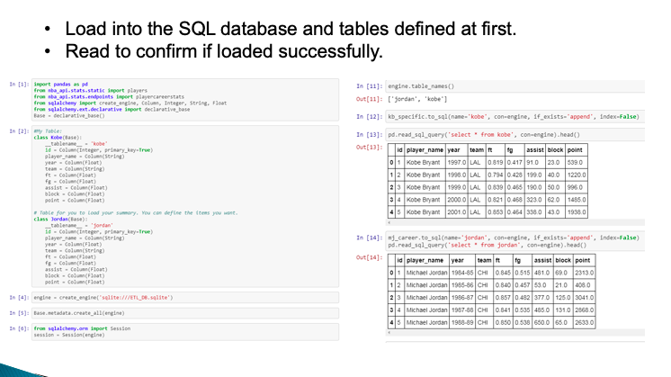
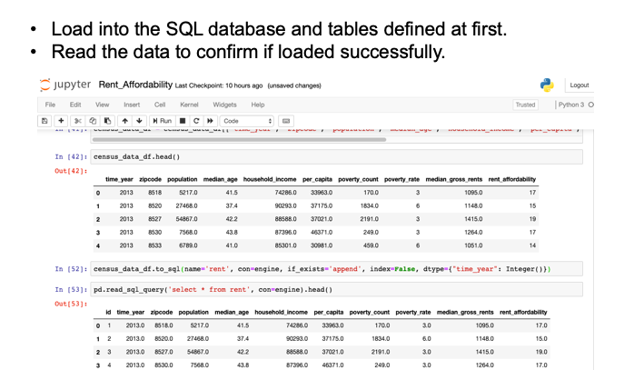

## ETL

### ETL#1
- Background: Summarize certain NBA players career performances.

- Summary:
  - E (Extraction): 2 open sources, 
     www.kaggle.com .  
     NBA-API  
  - T (Transform):  For each year, summarize the teams they used to play for, personal scores, FG%, FT%, assists and blocks. 
  - L (Load): Define the schema then loaded into SQL database for easily control and readability.  

### ETL#2
- Background: Use Census API and get the rent affordability and do web scraping to confirm the rent affordability data is in line with the   web scraping data  

- Summary:
  - E (Extraction): Using Census API & Web Scraping, gather data including household income and median gross rents by zip code  
      ACS5 Census API  
      http://mentalfloss.com/article/85668/11-most-affordable-cities-us  
  - T (Transform):  Calculate the Rent Affordability rate(median gross rent/household income) and do data munging  
       (drop NaN and delete      Null data etc) and save csv file  
  - L (Load): Define the schema then load into SQL database for easy control and readability.  

